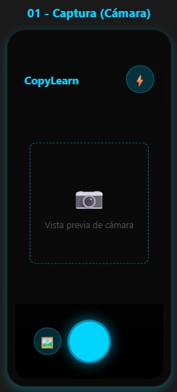
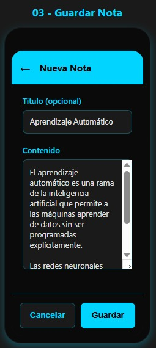
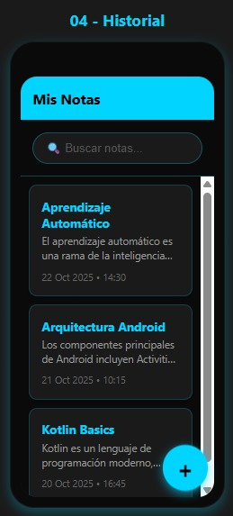
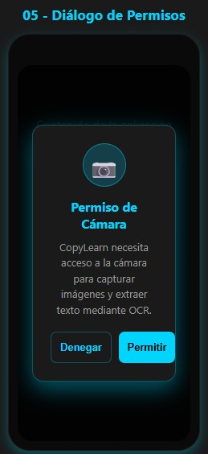

# 📄 CopyLearn – Captura y guarda texto con OCR

Aplicación Android desarrollada en **Kotlin** con Android Studio para **extraer texto** desde cámara o galería usando **OCR** (reconocimiento óptico de caracteres).
Permite **tomar una foto o importar una imagen**, ejecutar OCR **on-device**, **editar el resultado**, **copiar al portapapeles**, **guardar como nota** y **compartir** o **exportar a .txt**.
El proyecto aplica conocimientos de **CameraX/galería**, **persistencia local (Room)**, **diálogos** y **buenas prácticas de UX**.

---

## 🧩 Descripción general

**CopyLearn** convierte imágenes de texto (libros, carteles, apuntes, etc.) en **texto editable y reutilizable**.
El usuario puede capturar/seleccionar una imagen, ejecutar OCR local, **corregir el texto** y guardarlo como **nota** con historial y búsqueda.

**Características principales:**

* **Captura** desde cámara (CameraX) e **importación** desde galería.
* **OCR local** (ML Kit – Text Recognition) con soporte multilenguaje.
* **Edición** del texto reconocido (limpieza rápida y correcciones).
* Acciones: **Copiar**, **Guardar nota**, **Compartir**, **Exportar .txt**.
* **Historial de notas** con **búsqueda por texto** y orden por fecha.
* **Diálogos de confirmación** al eliminar o descartar cambios.
* **Almacenamiento local** con **Room (SQLite)**.
* **Privacidad**: procesamiento **on-device** (sin subir a servidores).
* Interfaz intuitiva con enfoque en **buenas prácticas de UX**.

---

## ⚙️ Tecnologías utilizadas

* **Lenguaje:** Kotlin
* **IDE:** Android Studio
* **Base de datos local:** Room (SQLite)
* **Arquitectura:** MVVM (Model–View–ViewModel)
* **UI:** XML o Jetpack Compose (según lo requiera el curso)
* **Componentes Android Jetpack:** ViewModel, LiveData/StateFlow, Room, Navigation
* **OCR:** Google ML Kit – Text Recognition (on-device)
* **Cámara:** CameraX (preview + captura)
* **Control de versiones:** Git y GitHub

---

## 📱 Mockups de la aplicación

> Los mockups deben subirse como imágenes en la carpeta `/docs/mockups/`
> Ejemplo de nombres:
> `01_camera.png`, `02_result_ocr.png`, `03_save_note.png`, `04_history.png`, `05_dialog_permissions.png`

### Pantallas principales

1. **Captura (cámara)**

    * Vista previa con botón “Capturar” y acceso a “Importar desde galería”.
2. **Resultado OCR / Edición**

    * Muestra el texto reconocido con acciones Copiar / Guardar / Compartir / Exportar .txt.
3. **Guardar nota**

    * Título opcional y contenido prellenado con el resultado OCR.
4. **Historial de notas**

    * Lista de notas con búsqueda por texto; ver, editar o eliminar.
5. **Diálogos y permisos (opcional)**

    * Solicitud de permisos y confirmaciones (eliminar, descartar cambios).

---

## 🚀 Flujo de trabajo (avances semanales)

Para mantener control de versiones y revisiones del profesor:

1. Trabajar en la rama `develop` o en ramas `feature/...`.
2. Crear un **Pull Request** hacia la rama `main`.
3. Asignar al profesor **@ebarahonautn** como revisor.
4. Esperar su aprobación (1 code review obligatorio).
5. Solo después de la aprobación se podrá hacer el merge a `main`.

> 🔒 La rama `main` está protegida: no se permiten commits ni push directos.

---

## 📋 Entregables

* **README.md:** incluye descripción del proyecto y mockups.
* **Repositorio GitHub:** con el profesor agregado como colaborador con permisos *Write*.
* **Avances semanales:** se suben por Pull Request para revisión.
* **URL del repositorio:** se entrega en el campus virtual.

---

## 👨‍🏫 Profesor

* **Nombre:** Esteban Barahona
* **Correo:** [ebarahona@utn.ac.cr](mailto:ebarahona@utn.ac.cr)
* **GitHub:** [ebarahonautn](https://github.com/ebarahonautn)

---

## 👤 Autor

* **Nombre:** Kevin Alfonso Núñez Parra
* **Correo:** [kevin.nunez@est.utn.ac.cr](mailto:kevin.nunez@est.utn.ac.cr)
* **GitHub:** [KevNu15](https://github.com/KevNu15)
* **Universidad:** Universidad Técnica Nacional – Costa Rica

---

## 🏁 Estado del proyecto

* ✅ Configuración inicial del repositorio (main y develop).
* ✅ Rama `main` protegida con revisión obligatoria.
* ✅ Profesor agregado con permiso *Write*.
* 🔄 En desarrollo: flujo cámara/galería → OCR → edición → guardado.
* ⏳ Próximos pasos: búsqueda en historial, exportación `.txt` y mejoras de UX.
